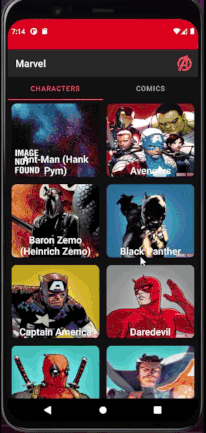

  

  App made using <a href="https://developer.marvel.com">Marvel Api</a>

  

## 🎨 Interface

## 🤖Tech stack & Open-source libraries
- Made in Kotlin
- [JetPack](https://developer.android.com/jetpack)
  - LiveData 
  - ViewModel
  - Room Persistence Library
  - Navigation Component
  - Coroutines
  - Data Binding
  - Koin for Dependency Injection
- Architecture
  - MVVM Architecture (View - ViewModel - Model)
  - Repository pattern
- [Retrofit2](https://github.com/square/retrofit)
- [Glide](https://github.com/bumptech/glide)

  
## Open API
  App uses [Marvel Api](https://developer.marvel.com).

## License
  All the code available under the MIT license. See [LICENSE](https://github.com/Prathamesh010/Marvel/blob/master/LICENSE).
